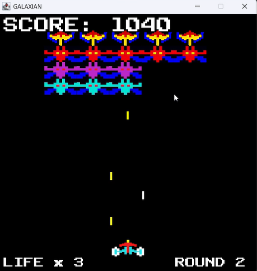

# Galaxian Java版

ナムコのシューティングゲーム「ギャラクシアン」をJava Swingを使用して再現してみました。

このゲームでは、プレイヤーは宇宙船を操作し、襲い来るエイリアンたちを撃退します。



## 特徴

- **エイリアンの攻撃 & 連射可能の自機の弾丸システム**
- **エイリアンをすべて倒すと次のラウンドへ**
- **サウンドエフェクト & BGM**
- **1UPシステム（ボーナススコアでライフが1追加）**
- **ゲームオーバー後にいずれかのキーを押すとリスタート**

## 🎮 操作方法

| アクション | 操作キー |
|------------|---------|
| **左右移動** | ← / → （1回押すごとに1マスずつ動くため、連打してください） |
| **弾丸発射** | スペースキー |

## スコア表

| エイリアン | スコア |
|------------|------|
| 旗艦 | **60 pts** |
| 赤エイリアン | **50 pts** |
| ピンクエイリアン | **40 pts** |
| シアンエイリアン | **30 pts** |

## 🛠️ 動作環境

- **JDK 23**
- **Java Swing**
- **Java Sound API**

## 🚀 実行方法

1. **Java をインストール**  
   Java Development Kit (JDK) をインストールしてください

   （最新版のJDKを推奨）

2. **リポジトリをクローン(ダウンロード)**  
   ターミナルまたはコマンドプロンプトで以下のコマンドを実行：
   ```sh
   git clone https://github.com/motomasMINO/Galaxian-Java.git
   
   cd Galaxian-Java

3. **コンパイル ＆ 実行**
以下のコマンドを使用して起動:
   ```sh
   javac App.java

   java App

　　※起動するとすぐにゲームがスタートします。

## 📜 ライセンス
このプロジェクトは MIT License のもとで公開されています。

📧 開発者

GitHub: motomasMINO

Email: yu120615@gmail.com

バグ報告や改善点の提案は Issues で受け付けています！
