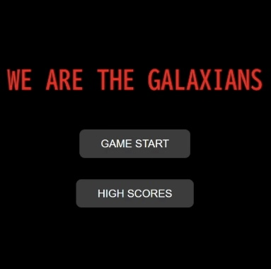
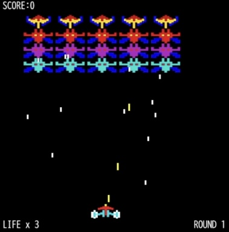
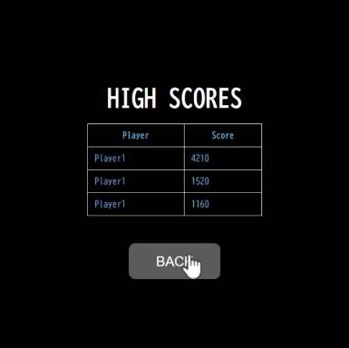

# Galaxian Java版

<<<<<<< HEAD
ナムコのシューティングゲーム「ギャラクシアン」をJava Swingを使用して作成してみました。
=======
ナムコのシューティングゲーム「ギャラクシアン」をSpring Bootを使用して再現してみました。
>>>>>>> 9c37c7f (Replace Swing app with Spring Boot version)





<<<<<<< HEAD
=======


>>>>>>> 9c37c7f (Replace Swing app with Spring Boot version)
## 概要

- **エイリアンの攻撃 & 連射可能の自機の弾丸システム**
- **エイリアンをすべて倒すと次のラウンドへ**
- **サウンドエフェクト & BGM**
<<<<<<< HEAD
- **1UPシステム(ボーナススコアでライフが1追加)**
- **ゲームオーバー後にいずれかのキーを押すとリスタート**
=======
- **1UPシステム（ボーナススコアでライフが1追加）**
- **ゲームオーバー後にスペースキーを押すとタイトル画面に戻ります。**
>>>>>>> 9c37c7f (Replace Swing app with Spring Boot version)

## 🎮 操作方法

| アクション | 操作キー |
|------------|---------|
| **左右移動** | ← / → |
| **弾丸発射** | スペースキー |

## スコア表

| エイリアン | スコア |
|------------|------|
| 旗艦 | **60 pts** |
| 赤エイリアン | **50 pts** |
| ピンクエイリアン | **40 pts** |
| シアンエイリアン | **30 pts** |

## 🛠️ 技術スタック
- **バックエンド**
   - Java 25 (Java 17+)
   - Spring Boot 3.x
   - REST API (スコア保存)
- **フロントエンド**
  - HTML / CSS
  - JavaScript

## 🚀 実行方法

1. **Javaをインストール**
   
   Java Development Kit(JDK)をインストールしてください。
   
   (最新版のJDKを推奨)

2. **リポジトリのクローン(ダウンロード)**
   
   ターミナルまたはコマンドプロンプトで以下を実行:
   ```bash
   git clone https://github.com/motomasMINO/Galaxian-Java.git
   cd Galaxian-Java
   ```

3. **アプリ起動**
<<<<<<< HEAD

   以下のコマンドを使用して起動:
   ```sh
   java -cp src App
   ```
　　※起動するとすぐにゲームがスタートします。
=======
   ```bash
   mvnw spring-boot:run
   ```

4. **ブラウザでアクセス**
   ```arduino
   http://localhost:8080
   ```
>>>>>>> 9c37c7f (Replace Swing app with Spring Boot version)

## 📜 ライセンス

<<<<<<< HEAD
## 📧 お問い合わせ
=======
このプロジェクトはMIT Licenseのもとで公開されています。
>>>>>>> 9c37c7f (Replace Swing app with Spring Boot version)

## 📧 お問い合わせ

- **Github: motomasMINO**

<<<<<<< HEAD
バグ報告や改善点・機能追加の提案はPull RequestまたはIssueで受け付けています！
=======
- **Email: yu120615@gmail.com**

  バグ報告や改善点・機能追加の提案はPull RequestまたはIssueで受け付けています!
>>>>>>> 9c37c7f (Replace Swing app with Spring Boot version)
