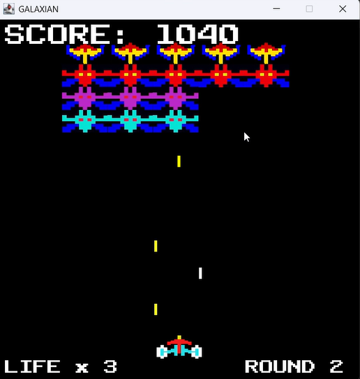

# Galaxian - Java版

ナムコのクラシックなアーケードシューティングゲームのギャラクシアンをJavaで再現してみました。

このゲームでは、プレイヤーは宇宙船を操作し、襲い来るエイリアンたちを撃退します。

## 特徴

- **エイリアンの攻撃 & 連射可能の自機の弾丸システム**
- **エイリアンをすべて倒すと次のラウンドに進めます**
- **サウンドエフェクト & BGM**
- **ライフシステム（ボーナススコアで残機追加）**
- **ゲームオーバー後にいずれかのキーを押すとリスタート**

## 🎮 操作方法

- **自機操作(左右移動) --- 方向キー(← / →) 

  [1回押すごとに1マスずつ動くため、連打してください]

- **弾丸を発射(弾丸操作) --- スペースキー

## スコア表

旗艦 --- 60 pts

赤エイリアン --- 50 pts

ピンクエイリアン --- 40 pts

シアンエイリアン --- 30 pts

## 🛠️ 動作環境

- **JDK 8 以上**
- **Java Swing**
- **Java Sound API**

## 🚀 実行方法

1. **Java をインストール**  
   Java Development Kit (JDK) をインストールしてください

   （JDK 8 以上を推奨）

2. **リポジトリをクローン(ダウンロード)**  
   ターミナルまたはコマンドプロンプトで以下のコマンドを実行：
   
   git clone https://github.com/motomasMINO/Galaxian-Java.git
   
   cd Galaxian-Java

3. **コンパイル ＆ 実行**
以下のコマンドを使用してゲームを起動:

   javac App.java

   java App

　　※アプリを起動するとすぐにゲームがスタートします。

## 📜 ライセンス
このプロジェクトは MIT License のもとで公開されています。

📧 開発者

GitHub: motomasMINO

Email: yu120615@gmail.com

バグ報告や改善点の提案は Issues で受け付けています！
